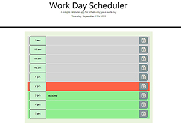

# WorkDayScheduler

# Links to deployed application and repository:
* [Deployed Application](https://sskumar4.github.io/WorkDayScheduler/)
* [Repository](https://github.com/sskumar4/WorkDayScheduler)

## Project Name: WorkDayScheduler
## Title: Work Day Scheduler

## Introduction:
A calendar application that allows the user to save events for each hour of the work day. This app will run in the browser and feature dynamically updated HTML and CSS powered by jQuery.

## Technologies: 
HTML, CSS, Javascript, jquery, Bootstrap

## Features
Created the following 
html files: 
  * index.html
js files: 
  * workScheduler.js
css files
  * style.css

Developed the site with the following features:

  * Used moment.js to work with day and time
  * When the User launches the application, current day is displayed at the top of the calendar
  * When the user scrolls downTime, blocks for standard business hours are presented from 9am to 5pm 
  * Each timeblock is color coded to indicate whether it is in the past (gray), present (red), or future (green)
  * User can enter an event by clicking into a timeblock
  * The entered event for that timeblock can be saved in local storage by clicking the save button
  * The pulse effect of the save button reminds the user to save after entering and moving away from the timeblock without saving 
  * When the page is rerefreshed the saved events persist

Used HTML validation service to ensure that each page has valid HTML.

## Launch

Launch [Deployed Application](https://sskumar4.github.io/WorkDayScheduler/) to view the page. 

